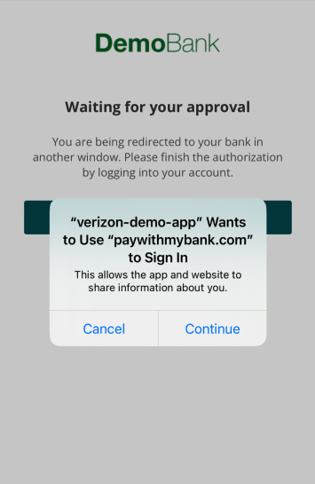

# About this demo

This app demo has a propose to demonstrate how to implement the oauth authentication in IOS apps.


**IMPORTANT:**

 `SFSafari` is not allowed to call a deep link, in other words, the code bellow will not work, for this reason our recomendation to use `SFAuthenticationSession` or `ASWebAuthenticationSession` according to your iOS version.

```javascript
    window.location.href = "myapp://"
```


## Introduction

We have two solutions to implement a better experience when the app needs to open a new browser window to do authentication.

- SFAuthenticationSession for **iOS 9 until 12**
- ASWebAuthenticationSession for **iOS 13 or higher**


### SFAuthenticationSession

This solution will work only for iOS version between 9 and 12.

```swift
    let session = SFAuthenticationSession(url: url, callbackURLScheme: calbackURL, completionHandler: { (url, error) in
        //TODO: add your custom behavior here
    })

    session.start()
```


### ASWebAuthenticationSession

This solution will work for iOS version 13 and higher.

First step, you need to import the `AuthenticationServices`.

```swift
    import AuthenticationServices
```

After that will be necessary extends the `ASWebAuthenticationPresentationContextProviding` in your controller.

```swift
    extension ViewController: ASWebAuthenticationPresentationContextProviding {
        func presentationAnchor(for session: ASWebAuthenticationSession) -> ASPresentationAnchor {
            return ASPresentationAnchor()
        }
    }
```

And finally, you can implement the method to create the oAuth behavior.

```swift
    let webSession = ASWebAuthenticationSession(url: url, callbackURLScheme: calbackURL, completionHandler: { (url, error) in
            //TODO: add your custom behavior here
        })
    
    webSession.prefersEphemeralWebBrowserSession = true
    webSession.presentationContextProvider = self
    webSession.start()
```

**IMPORTANT:**

The attribute `prefersEphemeralWebBrowserSession` controls if the `ASWebAuthenticationSession` will show the authorization alert or not.


